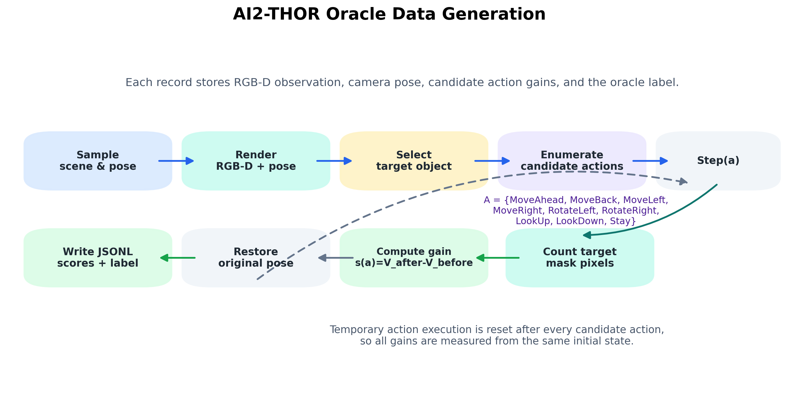
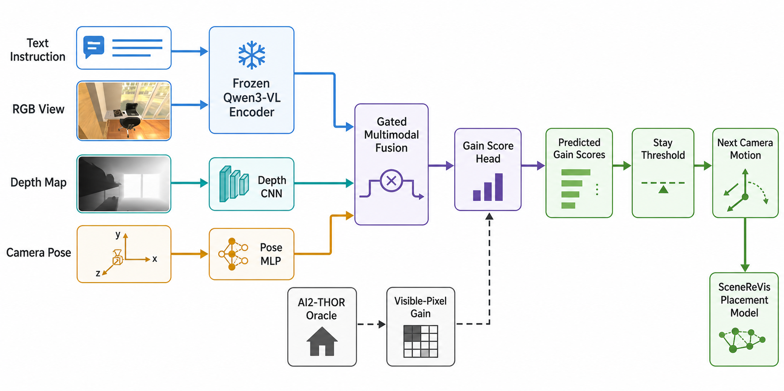
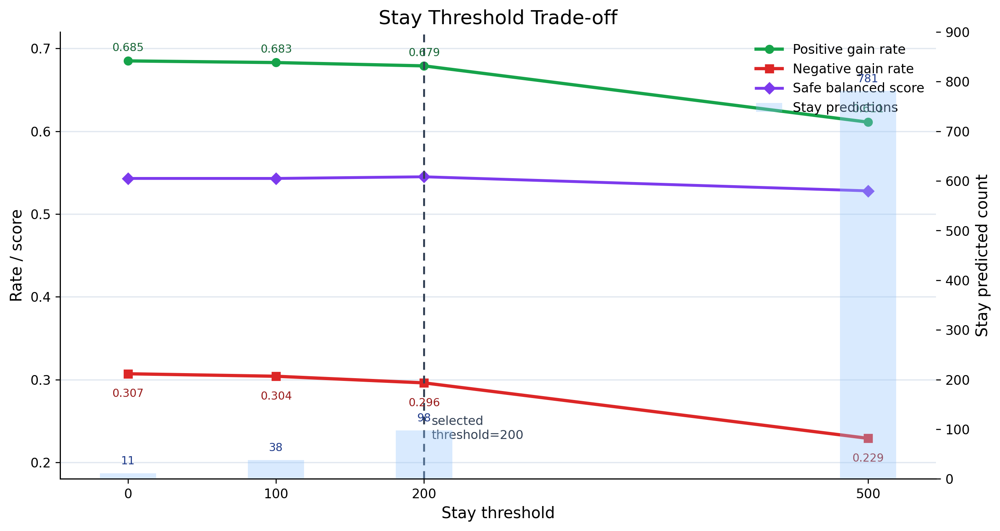
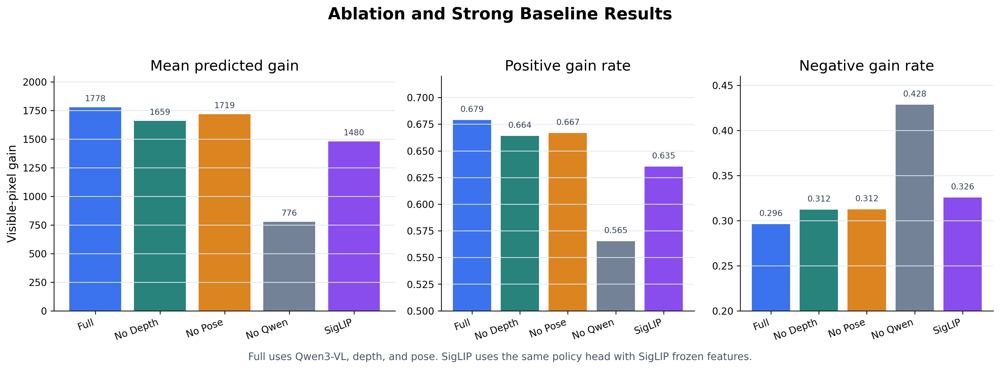

# See2Move：面向摆放模型的可见性驱动相机运动预测

## 摘要

现有 Vision-Language-Action（VLA）和 World Action Model（WAM）工作大多面向真实机器人操作、室内导航或通用具身控制，关注如何根据视觉和语言指令直接生成操作动作或导航动作。然而，在 Technical Artist（TA）和三维场景编辑工作流中，许多操作并不是从“直接摆放”开始，而是需要先获得一个更清晰、更少遮挡的观察视角。对于 SceneReVis 这类场景重排或物体摆放模型，若当前相机视角无法清楚观察目标物体、支撑面或操作区域，后续摆放预测可能受到遮挡和局部几何缺失的影响。

本文提出 See2Move，一个为摆放模型提供前置视角辅助的相机运动预测框架。给定文本意图、当前 RGB 视图、深度图和相机位姿，See2Move 预测下一步相机动作，使目标物体或操作区域在下一视角中更可见。与传统 Vision-Language Navigation（VLN）方法不同，See2Move 不以到达目标位置或路径跟随为主要目标，而是直接预测每个候选相机动作带来的可见性收益（visibility gain），并选择预期收益最大的动作。本文利用 AI2-THOR 仿真环境自动生成监督信号，通过 instance segmentation mask 计算目标物体在当前视角和候选动作后视角中的可见像素变化。模型融合冻结的 Qwen3-VL hidden state、深度图编码和相机位姿特征，训练一个轻量 gain-score policy，并通过 Stay 动作和 stay-threshold 策略减少无收益或负收益相机移动。在 5000 条 AI2-THOR oracle records 上，Qwen3-VL gain-score policy 在 stay-threshold = 200 时取得 1777.62 的平均真实可见性收益和 0.679 的 positive gain rate，优于 SigLIP 强基线的 1479.99 和 0.6352，也显著优于去除视觉语言特征后的 776.45 和 0.5652。

## 关键词

Technical Artist；场景摆放；SceneReVis；视角调整；相机运动预测；可见性提升；深度图；AI2-THOR

## 1 引言

### 1.1 研究背景

随着大规模视觉语言模型和具身智能技术的发展，智能体已经能够在一定程度上理解视觉场景、语言指令和动作之间的关系。VLA 模型尝试将视觉输入、文本指令和低层动作统一到一个端到端框架中，典型应用包括机器人抓取、移动操作和交互式任务执行。与此同时，VLN 方法研究智能体如何根据语言指令在室内环境中移动，并在连续环境中执行低层导航动作。

然而，TA 和三维场景编辑任务中的需求与传统机器人操作或导航任务并不完全相同。在 DCC 软件、游戏引擎或仿真环境中，操作对象通常是已经存在的三维场景。对于 SceneReVis 这类摆放或场景重排模型，核心目标是根据场景上下文生成合理的物体位置、朝向或重排方案。但在执行摆放预测之前，系统往往需要先获得足够清楚的观察视角，以理解目标物体、支撑面、遮挡关系和局部几何结构。

例如，当用户希望将椅子放到桌子下方时，当前相机视角可能被桌面、桌腿或其他家具遮挡。若摆放模型只能基于当前受遮挡视角进行推理，就可能无法准确判断桌下空间是否可用、目标区域是否被占用，以及物体之间的空间关系是否合理。因此，一个面向摆放模型的前置视角调整模块是有价值的：它不直接完成摆放，而是预测下一步相机移动，为后续摆放模型提供更清晰、更少遮挡的输入观测。

### 1.2 问题动机

在真实机器人场景中，模型通常需要从二维图像中估计三维结构，例如深度、相机位姿、点云或物体几何关系。近年来，视觉几何模型可以从图像中恢复相机参数、深度图和三维点云，为机器人和 embodied AI 提供重要几何先验。但在 TA 所处的三维创作环境中，大量几何信息本身就是场景的一部分。DCC 软件、游戏引擎和仿真平台通常可以直接提供 mesh、depth buffer、object transform、camera pose、instance id 和 object visibility 等信息。

这意味着面向 TA 和场景摆放的 agent 不必完全依赖外部三维重建模型，而可以直接利用创作环境中已有的几何信号。See2Move 正是基于这一设定：它利用当前 RGB、深度图和相机位姿，学习如何移动相机以提升目标区域的可见性。该模块可以作为 SceneReVis 等摆放模型的上游辅助组件，在摆放预测前主动寻找更合适的观察视角。

### 1.3 本文贡献

本文提出 See2Move，一个面向摆放模型的可见性驱动相机运动预测框架。本文的主要贡献如下：

1. 提出一个面向摆放模型前置感知的任务定义，将语言条件下的相机运动预测建模为目标可见性提升问题，而不是传统路径跟随或 waypoint 预测问题。

2. 构建基于 AI2-THOR 的 oracle 数据生成流程，利用仿真环境中的 instance mask、深度图和相机位姿自动获得候选动作后的目标可见像素变化，避免人工标注下一步相机动作。

3. 设计一个多模态 gain-score policy，融合 Qwen3-VL hidden state、深度图编码和相机位姿特征，直接预测每个候选相机动作的可见性收益。

4. 引入 Stay 动作和 stay-threshold 推理策略，使模型能够在预期移动收益不足时保持当前视角，从而减少无收益或负收益相机移动。

5. 将 See2Move 定位为 SceneReVis 等摆放/场景重排模型的前置辅助模块，为后续摆放预测提供更清晰、更少遮挡的观察输入。

### 1.4 研究定位与适用边界

本文的研究目标并不是替代现有的摆放模型、场景重排模型或通用 VLA 模型，而是补足它们在执行摆放推理前的一个关键环节：主动获得更有用的观察视角。对于 TA 工作流而言，用户通常关心的是一个可编辑的三维场景，而不是一个完全未知的真实世界环境。因此，系统可以使用渲染管线和仿真环境中天然可得的深度、相机位姿、实例 ID 与物体变换信息。这一设定使 See2Move 不必把主要能力消耗在从二维图像恢复三维几何上，而可以更直接地学习“下一步相机动作是否能改善目标区域可见性”。

同时，See2Move 与传统 VLN 的问题边界也不同。VLN 强调从起点到终点的长程路径规划，通常评价 agent 是否成功到达目标位置；See2Move 强调短程、局部、面向下游摆放推理的视角调整。它的输出可以是一次相机移动、旋转、俯仰调整，或在当前视角足够好时保持不动。这样的设计更符合 TA/场景编辑任务中的交互节奏：模型先帮助用户或下游摆放系统“看清楚”，再由摆放模型完成具体物体放置或场景重排。

从应用角度看，See2Move 可以作为 SceneReVis 一类本地摆放模型的前置观察模块。对于“将椅子放到桌子下”“检查床边是否能放边桌”“观察柜子内部空间”等任务，摆放模型本身需要推理空间可用性和局部遮挡关系。若输入视角被遮挡，摆放质量会受到影响。See2Move 的价值在于降低这一前置感知瓶颈，使后续模型获得更可靠的 RGB-D 观察和相机状态。

### 1.5 论文结构

第 2 章综述 VLN、VLA/WAM、仿真环境、场景摆放、视觉基础模型和主动视觉相关工作，并明确本文与这些方向的区别。第 3 章介绍 See2Move 的任务定义、oracle 数据生成、模型结构、训练目标和 Stay 推理策略。第 4 章给出 AI2-THOR 实验设置、评价指标、主实验、阈值分析和消融实验。第 5 章讨论局限性与从显式目标迁移到隐式操作区域的未来方向。第 6 章总结本文工作。

## 2 相关工作

### 2.1 Vision-Language Navigation

Vision-Language Navigation 研究智能体如何根据自然语言指令在环境中移动 [1]。早期 VLN 任务多基于 Matterport3D 等真实感室内环境上的离散导航图，智能体在预定义节点之间移动 [3]；Habitat 则为 embodied navigation 研究提供了常用仿真平台 [4]。VLN-CE 将任务扩展到连续环境，使 agent 需要在更接近真实物理空间的场景中执行低层移动动作 [2]。后续工作进一步探索 waypoint 预测、拓扑规划和跨模态 Transformer 等方法，以提升连续环境中的导航能力 [5,6,7,8]。

此类方法为语言条件下的视觉运动决策提供了重要基础，但其主要目标通常是完成路径跟随或到达目标位置，评价指标包括 success rate、SPL、路径长度等。相比之下，See2Move 关注的是局部视角调整。模型不需要完成长程导航，而是判断下一步相机动作是否能提升目标物体或操作区域的可见性，从而为后续摆放模型提供更好的输入视角。

### 2.2 Vision-Language-Action Models 与 World Action Models

VLA 模型试图将视觉、语言和动作统一到一个端到端模型中。以 RT-1、RT-2、PaLM-E、OpenVLA、Octo 和 pi-zero 为代表的工作将大规模视觉语言模型或通用策略模型迁移到机器人控制，使模型能够根据图像和语言指令输出机器人动作 [13,15,16,18,19,20]。WAM 相关工作进一步探索从视频、轨迹或世界模型中学习动作条件下的状态变化。这些方法通常面向机器人 manipulation、移动机器人控制或通用 embodied control [14,17,21]。

尽管 VLA/WAM 方法可以理论上扩展到相机控制，但现有研究较少直接面向 TA 场景中的摆放前视角调整任务。对于 SceneReVis 这类摆放模型而言，动作预测并不总是等价于直接移动物体；在很多情况下，系统需要先调整视角以获得更可靠的局部几何和遮挡信息。See2Move 可视为 VLA/WAM 思路在 TA 场景中的一个具体化：动作空间不是机械臂末端执行器控制，而是相机移动与视角调整；优化目标不是任务成功率本身，而是下一步动作带来的目标可见性收益。

### 2.3 三维几何感知、仿真环境与摆放模型

在真实世界设置中，模型通常需要从 RGB 图像中估计深度、相机位姿或三维结构。视觉几何模型展示了从一张或多张图像预测相机参数、深度图和点云的能力，为缺乏显式三维信息的场景提供了重要补充。然而，在 DCC 软件、游戏引擎和仿真环境中，许多三维信息已经由环境直接维护。

AI2-THOR 是一个可交互三维室内环境，能够提供 RGB 图像、深度图、实例分割和 agent pose 等信息 [9]。ALFRED、TEACh 和 RoboTHOR 等 embodied AI benchmark 也展示了交互式仿真环境在 grounded language 与视觉决策中的价值 [10,11,12]。本文利用 AI2-THOR 的 instance segmentation mask 计算目标物体在当前视角和候选动作后视角中的可见像素数，并将二者差值作为动作 gain score。相比从二维图像中额外重建三维几何，本文方法直接使用仿真环境中的原生几何和可见性信息，因此数据生成成本更低，监督信号也更贴合任务目标。

与摆放模型的关系上，See2Move 不替代 SceneReVis 等模型的摆放预测能力，而是补足其前置感知环节。摆放模型通常需要理解目标区域、支撑关系、遮挡关系和场景上下文。See2Move 通过预测更合适的相机动作，使后续摆放模型能够在更清晰的视角下进行推理。

### 2.4 场景生成、物体摆放与场景重排

室内场景生成和物体摆放任务关注如何根据房间结构、已有物体和语义关系生成合理的三维布局。3D-FRONT 提供了大规模带有布局和语义信息的室内场景数据，为后续室内场景合成和摆放任务提供了重要数据基础 [22]。SceneFormer 使用 Transformer 建模室内物体序列及其位置和朝向 [23]。ATISS 将室内场景合成建模为无序物体集合的自回归生成问题，可用于场景补全和局部重排 [24]。InstructScene 进一步引入语言指令和语义图先验，以提升文本驱动三维室内场景生成的可控性 [25]。

这些工作关注的是“如何生成或调整场景布局”，而 See2Move 关注的是摆放预测之前的“如何看清目标区域”。因此，See2Move 与摆放/场景重排模型是互补关系：摆放模型负责生成物体位置和空间关系，See2Move 负责选择更适合观察目标区域、支撑面和遮挡关系的相机视角。

### 2.5 视觉基础模型、语言 grounding 与三维几何估计

近年来，视觉基础模型和开放词汇感知模型显著提升了从图像中提取语义和几何信息的能力。CLIP 通过大规模图文对比学习获得可迁移的视觉语言表示 [26]，Qwen3-VL 等大规模视觉语言模型进一步提升了多分辨率图像、文本和视频输入的统一建模能力 [27]。在开放词汇定位和分割方面，Segment Anything 提供了可提示的通用分割能力 [28]，Grounding DINO 支持基于类别名或指代表达的开放集目标检测 [29]。在几何方面，Depth Anything 通过大规模无标注数据提升单目深度估计泛化能力 [30]，DUSt3R、MASt3R 和 VGGT 等方法进一步探索从图像中估计深度、相机位姿、匹配关系或三维点云 [31,32,33]。

这些方法对于缺乏显式三维信息的真实图像场景非常重要。与之不同，TA 和仿真/DCC 环境通常已经提供 depth buffer、camera pose、mesh、object transform 和 instance id 等原生三维信号。See2Move 的相对优势在于不必先从二维图像重建三维几何，而是直接利用环境已有信息来学习视角调整策略。

### 2.6 主动视觉与 Next-Best-View

主动视觉认为感知系统可以通过控制相机或传感器运动来主动获取更有用的信息 [34]。Next-Best-View（NBV）规划进一步研究如何选择下一个视角，以最大化三维重建、目标覆盖或信息增益。典型方法包括基于空间探索和 shadowcasting 的视角规划 [35]，以及面向被遮挡目标重建的形状补全驱动 NBV 方法 [36]。

See2Move 与主动视觉/NBV 的目标具有相似性，即都希望通过移动视角获得更有用的观测。但本文任务具有两个不同点：第一，See2Move 是语言条件的，视角选择由用户意图和摆放需求驱动；第二，本文关注的是 TA/摆放模型的局部可见性提升，而不是通用三维重建覆盖率。因此，See2Move 可以看作是面向摆放模型前置感知的 language-conditioned next-view prediction。

## 3 方法

### 3.1 任务定义

给定当前观测状态：

$$
o_t = \{I_t, D_t, p_t, x\}.
$$

其中，$I_t$ 表示当前 RGB 图像，$D_t$ 表示深度图，$p_t$ 表示相机位姿，$x$ 表示文本指令或摆放意图。模型需要从候选动作集合 $\mathcal{A}$ 中选择下一步相机动作：

$$
\mathcal{A} =
\{\text{MoveAhead}, \text{MoveBack}, \text{MoveLeft}, \text{MoveRight},
\text{RotateLeft}, \text{RotateRight}, \text{LookUp}, \text{LookDown}, \text{Stay}\}.
$$

本文不将任务简单建模为动作分类，而是预测每个候选动作带来的可见性收益：

$$
g(a) = V_{\mathrm{after}}(a) - V_{\mathrm{current}}.
$$

其中，$V_{\mathrm{current}}$ 是目标物体或目标区域在当前视角中的可见像素数，$V_{\mathrm{after}}(a)$ 是执行动作 $a$ 后目标在新视角中的可见像素数。模型输出每个动作的预测收益 $\hat{g}(a)$，并选择预测收益最大的动作：

$$
a^{*} = \operatorname*{arg\,max}_{a \in \mathcal{A}} \hat{g}(a)
$$

在与 SceneReVis 等摆放模型结合时，See2Move 的输出动作可用于更新相机视角；更新后的 RGB-D 观测和相机位姿再输入摆放模型，从而提升后续摆放预测的可见性条件。

### 3.2 Oracle 数据生成

本文使用 AI2-THOR 自动生成训练数据。对于每个采样状态，首先随机选择场景、相机位置、相机朝向和目标物体。随后记录当前 RGB 图像、深度图、相机位姿和文本指令。对每个候选动作，环境临时执行该动作，计算目标物体在新视角中的 instance mask 面积，并将相机恢复到原始状态。

当前可见像素数由 AI2-THOR 的 instance segmentation mask 得到。环境返回的 `event.instance_masks` 包含每个物体实例对应的二值 mask。对于目标物体 `target_id`，mask 中像素值求和即为该目标在当前相机视图中的可见像素数：

$$
V = \sum_{u,v} M_{\mathrm{target}}(u,v).
$$

候选动作的监督分数定义为：

$$
s(a) = V_{\mathrm{after}}(a) - V_{\mathrm{before}}.
$$

如果所有移动动作的收益均不为正，则 oracle label 设为 `Stay`。因此，`Stay` 的 GT score 为 $0$，表示保持当前视角不会提升可见性，但可以避免负收益移动。

为了降低人工标注成本，整个数据生成过程完全由仿真环境驱动。具体而言，生成器首先在场景集合中采样一个房间，再从 AI2-THOR 返回的 reachable positions 中采样 agent 位置，并随机设置朝向和相机俯仰角。随后，生成器在当前视角中选择一个可交互或可观察的目标物体，并根据物体类别生成自然语言指令，例如“Move the camera to get a clearer view of the countertop.”。对于每个候选动作，生成器执行“临时动作—测量可见像素—恢复原状态”的过程，因此每条记录都包含完整的候选动作收益分布，而不仅仅是一个离散标签。



$$
\begin{aligned}
&\textbf{Input: } \mathcal{S}, \mathcal{A}, N \\
&\textbf{while } |\mathcal{D}| < N \textbf{ do} \\
&\quad \xi \sim \mathcal{S}, \quad p \sim \mathrm{ReachablePoses}(\xi) \\
&\quad o_t \leftarrow \mathrm{Render}(\xi,p), \quad V_{\mathrm{current}} \leftarrow \mathrm{VisiblePixels}(o_t,\mathrm{target}) \\
&\quad \textbf{for } a \in \mathcal{A}\setminus\{\mathrm{Stay}\} \textbf{ do} \\
&\quad\quad o_{t+1}^{a} \leftarrow \mathrm{Step}(o_t,a), \quad
s(a) \leftarrow V_{\mathrm{after}}(a)-V_{\mathrm{current}} \\
&\quad\quad \mathrm{RestorePose}(p) \\
&\quad \textbf{end for} \\
&\quad s(\mathrm{Stay}) \leftarrow 0 \\
&\quad y \leftarrow
\begin{cases}
\mathrm{Stay}, & \max_{a \in \mathcal{A}\setminus\{\mathrm{Stay}\}} s(a) \le 0,\\
\operatorname*{arg\,max}_{a \in \mathcal{A}} s(a), & \text{otherwise}.
\end{cases}
\end{aligned}
$$

该 oracle 具有两个优点。第一，它保留了所有候选动作的连续收益，因此后续模型可以学习动作之间的相对优劣，而不是只学习单一类别标签。第二，它直接使用仿真环境中的 instance mask 和深度缓冲区，避免了人工标注“下一步该往哪看”的主观性。其局限在于当前监督信号仍主要围绕显式目标物体定义，隐式空间区域的监督仍需在后续工作中扩展。

### 3.3 模型结构

See2Move 采用多模态融合结构。文本指令与 RGB 视图首先通过冻结的 Qwen3-VL 模型提取 hidden state，用于表示高层语义和视觉上下文。深度图通过轻量卷积网络编码，用于提供距离、遮挡和局部几何线索。相机位姿通过 MLP 编码，用于表示当前相机在环境中的空间状态。



三类特征经过拼接后输入 gated fusion 模块，得到统一状态表示。最后，gain-score head 输出每个候选动作对应的预测收益：

$$
\left[\hat{g}(\text{MoveAhead}), \ldots, \hat{g}(\text{Stay})\right].
$$

该结构使模型能够同时利用语言意图、视觉语义、深度几何和相机姿态信息，判断不同相机动作对目标可见性的影响。

#### 3.3.1 Qwen3-VL 特征抽取

本文使用本地冻结的 Qwen3-VL 模型作为高层视觉语言编码器。对于每条记录，将文本指令与当前 RGB 图像共同输入 Qwen3-VL，开启 `output_hidden_states=True`，取最后一层 hidden state。由于输入序列包含图像 token、文本 token 以及特殊 token，本文使用 attention mask 对最后一层 hidden state 做 masked mean pooling，得到单个全局多模态特征向量。该特征以 float16 保存到本地特征文件中，训练策略网络时不再反向传播到 Qwen3-VL，从而降低显存和训练时间开销。

训练阶段，Qwen3-VL pooled feature 首先经过 `LayerNorm -> Linear -> ReLU -> Dropout` 投影到 512 维，作为语义与视觉上下文分支。这样的做法不是端到端微调 VLM，而是将 VLM 作为 frozen perceptual prior 使用。其优点是实现成本低、训练稳定，适合当前 5000 条样本规模；不足是 Qwen3-VL 特征并未针对“相机移动导致可见性变化”这一目标做专门适配。

#### 3.3.2 深度图与位姿编码

深度图来自 AI2-THOR 的 depth frame。预处理时先将 NaN 和无穷值替换为有效范围内的数值，再将深度裁剪到 `[0, 5m]` 并归一化到 `[0,1]`。在 Qwen3-VL gain-score 模型中，深度输入并不是单通道 raw depth，而是三通道深度特征栈：

$$
D_{\mathrm{stack}} =
\left[D,\; 1-D,\; D_{\mathrm{edge}}\right].
$$

其中 $D_{\mathrm{edge}}$ 由水平和垂直方向的深度差分近似得到，用于显式提示局部几何边界和遮挡变化。三通道深度图被 resize 到 $128 \times 128$，并输入轻量残差 CNN。该 CNN 包含 stride convolution、residual block、adaptive average pooling 和线性投影，最终输出 128 维 depth feature。

相机位姿编码为 7 维向量：

$$
\mathbf{p} =
\left[x,\; y,\; z,\; \sin(\theta),\; \cos(\theta),\; h/90,\; \mathbb{1}_{\mathrm{standing}}\right].
$$

使用 $\sin(\theta)$ 和 $\cos(\theta)$ 而不是直接使用 yaw 角，可以避免 $0^\circ$ 和 $360^\circ$ 附近的不连续性。该 7 维向量经过 `Linear -> LayerNorm -> ReLU` 投影到 64 维。位姿特征帮助模型理解当前相机在房间中的空间状态，以及 MoveAhead、RotateLeft、LookDown 等动作对下一视角的几何影响。

#### 3.3.3 融合与动作收益头

模型将 Qwen3-VL 特征、深度特征和位姿特征拼接后输入 gated fusion 模块。设拼接后的特征为 $\mathbf{z}$，门控分支输出 $\sigma(\mathrm{MLP}(\mathbf{z}))$，融合输入为：

$$
\mathbf{z}_{\mathrm{fused}}
= \mathbf{z} \odot \sigma(\mathrm{MLP}(\mathbf{z})).
$$

随后，$\mathbf{z}_{\mathrm{fused}}$ 经过两层 MLP、LayerNorm、ReLU 和 Dropout 得到 512 维融合表征，最终线性映射到 9 个动作的 predicted gain score。训练时使用 modality dropout 随机置零某些模态分支，以减少模型对单一模态的过度依赖，并提高消融和部署时的鲁棒性。

### 3.4 训练目标

模型训练目标包含两个部分。第一部分是 score regression loss，使模型直接拟合每个候选动作的真实 gain score。第二部分是 ranking loss，使 oracle 最优动作的预测分数高于其他候选动作。整体损失为：

$$
\mathcal{L}
= \lambda_{\mathrm{score}}\mathcal{L}_{\mathrm{score}}
+ \lambda_{\mathrm{rank}}\mathcal{L}_{\mathrm{rank}}.
$$

当前实现中，分类交叉熵辅助项被关闭，使模型主要学习连续 gain score，而不是将任务退化为动作标签分类。这一设计与任务目标更加一致，因为在视角调整中，多个动作可能都能带来正收益，关键在于比较它们的预期收益大小。

更具体地，score regression loss 使用候选动作的真实 gain score 作为监督。由于原始像素差可能达到数千甚至上万，训练时将 score 除以 `score_scale=1000` 后再回归，以稳定梯度范围。ranking loss 则鼓励 oracle-best action 的预测分数高于其他动作，并使用 margin 约束动作之间的排序关系。当前主模型设置为：

$$
\mathcal{L}
= 1.0 \cdot \mathcal{L}_{\mathrm{score}}
+ 0.5 \cdot \mathcal{L}_{\mathrm{rank}}
+ 0.0 \cdot \mathcal{L}_{\mathrm{ce}}.
$$

其中 $\mathcal{L}_{\mathrm{ce}}$ 被显式置零。优化器使用 AdamW，初始学习率为 $10^{-3}$，权重衰减为 $5\times10^{-4}$，batch size 为 64，训练最多 25 个 epoch。学习率调度采用 cosine schedule，最小学习率为 $5\times10^{-5}$。训练过程中使用梯度裁剪，最大范数为 1.0；checkpoint selection 使用验证集上的 `oracle_gain.mean_predicted_score`，early stopping patience 设置为 8。

### 3.5 Stay 阈值推理

由于模型输出的是连续 gain score，推理时可能对某些低收益动作给出轻微正分，从而导致不必要移动。为此，本文引入 stay-threshold 策略：

$$
\hat{a} =
\begin{cases}
\mathrm{Stay}, &
\max\limits_{a \in \mathcal{A}\setminus\{\mathrm{Stay}\}}\hat{g}(a) \le \tau,\\
\operatorname*{arg\,max}_{a \in \mathcal{A}}\hat{g}(a), & \text{otherwise}.
\end{cases}
$$

其中，$\tau$ 是绝对 gain 阈值。该策略不依赖推理阶段的真实目标 mask，因此可用于没有 oracle visibility 的部署设置。实验中可通过扫描不同阈值，分析 positive gain rate、negative gain rate 和 mean predicted score 之间的权衡。

### 3.6 与摆放模型的接口

See2Move 可作为摆放模型的前置模块。给定用户摆放意图和当前场景观测，See2Move 首先预测下一步相机动作。如果模型判断当前视角已经足够好，则输出 `Stay`；否则移动相机以获得更高可见性的视角。随后，SceneReVis 等摆放模型可以使用更新后的 RGB-D 视图、相机位姿和场景状态进行物体摆放或场景重排推理。

这一设计将“看清楚目标区域”和“生成摆放方案”解耦：See2Move 负责选择更适合观察和判断空间关系的视角，摆放模型负责在更可靠的输入基础上生成具体摆放结果。

## 4 实验与结果

### 4.1 实验设置

本文在 AI2-THOR 环境中构建可见性驱动的相机运动预测数据集。数据集覆盖厨房、客厅、卧室和浴室等 120 个室内场景，共包含 5000 条 oracle 记录。每条记录包含文本指令、当前 RGB 图像、深度图、相机位姿、目标物体信息、候选动作集合以及每个候选动作对应的可见性收益。候选动作集合包含 9 类动作：

```text
MoveAhead, MoveBack, MoveLeft, MoveRight,
RotateLeft, RotateRight, LookUp, LookDown, Stay
```

目标物体类型覆盖 CounterTop、Cabinet、Bed、Shelf、Chair、SideTable、DiningTable、Sofa、Sink、Toilet、Bathtub、Desk 等多种室内物体。数据生成时，AI2-THOR 提供 instance segmentation mask，本文通过目标物体 mask 的像素数量计算当前视角和候选动作后视角中的目标可见面积。候选动作的监督分数定义为动作后的可见像素数减去当前可见像素数。

模型训练采用 Qwen3-VL 提取的冻结 hidden state 作为语言与视觉语义特征，深度图通过轻量 CNN 编码，相机位姿通过 MLP 编码。策略头输出每个候选动作的 predicted gain score。训练目标由 score regression loss 和 ranking loss 组成。训练过程中使用 scene split 选择最佳 checkpoint；本章中的离线评估使用统一的 5000 条 records 进行比较，以保证不同模型在同一批状态上评估。

数据集统计显示，5000 条记录覆盖 120 个场景和 17 类目标物体。动作标签分布并不完全均衡，其中 MoveAhead、RotateRight、RotateLeft 和 LookDown 出现频率较高，而 MoveBack 与 Stay 占比较低。这种不均衡来自任务本身：在随机室内视角中，前进、旋转和向下观察更常提升目标可见性，而后退或保持不动通常只在特定遮挡与距离条件下成为最优选择。因此，本文同时报告 accuracy、macro F1 和 gain-based metrics，避免仅由高频动作主导结论。

本文实验在 WSL 环境中运行，数据和特征存储在本地 HDD 路径 `/mnt/f/see2move`，代码位于 `/mnt/e/project/see2move`。Qwen3-VL hidden state 预先离线抽取，训练时只加载 pooled feature tensor。该设置降低了训练阶段显存需求，使 gain-score policy 可以在普通单机环境中快速迭代。由于 Qwen3-VL 特征抽取耗时较长，本文将“特征抽取”和“策略训练”分离：前者作为一次性预处理，后者用于主实验、阈值扫描和消融实验。

### 4.2 评价指标

本文使用以下指标评估模型：

1. **Accuracy**：预测动作与 oracle label 一致的比例。
2. **Macro F1**：各动作类别 F1 的宏平均值，用于衡量动作预测是否均衡。
3. **Top-2 / Top-3 Accuracy**：oracle 动作是否出现在模型预测分数最高的前 2 或前 3 个动作中。
4. **Mean Predicted Score**：模型最终选择动作对应的真实可见性收益平均值。
5. **Positive Gain Rate**：模型选择动作后真实可见性收益大于 0 的比例。
6. **Negative Gain Rate**：模型选择动作后真实可见性收益小于 0 的比例。
7. **Relative Gain**：模型选择动作带来的相对可见性收益，定义为

$$
r(a) = \frac{s(a)}{\max(V_{\mathrm{current}}, 1)}.
$$

该指标用于缓解绝对像素 gain 受物体尺寸影响的问题。大物体天然可能产生更大的像素差，而 relative gain 更关注相对当前可见面积的改善幅度。
8. **Safe Balanced Gain Score**：仅用于 Stay 阈值选择的辅助诊断指标，综合 macro F1、positive gain rate 和 nonnegative gain rate，定义为

$$
S_{\mathrm{safe}}
= 0.4 \cdot \mathrm{MacroF1}
+ 0.4 \cdot R_{\mathrm{pos}}
+ 0.2 \cdot R_{\mathrm{nonneg}}.
$$

该指标不是主要结论指标，也不用于证明模型整体优劣；它只用于阈值选择时同时观察动作类别均衡性、正收益比例和避免负收益移动。本文的主要结论仍基于 macro F1、mean gain、relative gain、positive gain rate 和 negative gain rate。
9. **Stay Predicted Count / Stay Recall**：模型选择 Stay 的次数及其对 oracle Stay 样本的召回率。

对于摆放模型辅助任务而言，accuracy 并不是唯一目标。由于多个动作可能都带来正收益，模型即使没有预测到 oracle label，也可能产生有用视角。因此，mean predicted score、positive gain rate 和 negative gain rate 更直接反映 See2Move 是否能为后续 SceneReVis 等摆放模型提供更好的观察视角。

本文还关注 `top-2` 和 `top-3` accuracy。它们衡量 oracle 最优动作是否出现在模型得分最高的前几个候选动作中。对于实际部署而言，这一指标有两层意义：第一，若后续系统允许执行短序列搜索或结合物理可达性过滤，top-k 候选可以提供备选动作；第二，较高 top-k accuracy 说明模型虽然有时没有选中唯一 oracle label，但已经学到了较合理的动作排序。相比单纯 accuracy，top-k 指标更能反映 gain-score policy 对候选动作收益结构的理解。

需要强调的是，Top-2/Top-3 accuracy 在 9 动作空间中并非最核心指标，因为随机 Top-3 已有约 33.3% 的命中率。本文将其作为动作排序质量的辅助参考，而不作为证明方法有效性的主要依据。与摆放辅助任务更直接相关的是：模型是否提升了目标可见性、是否减少了负收益动作，以及相对当前可见面积是否产生了足够改善。

### 4.3 Gain-Score 训练与分类训练对比

早期模型将任务建模为 9 类动作分类。该模型在全量记录上的 accuracy 为 0.217，macro F1 为 0.099，mean predicted score 为 642.64，positive gain rate 为 0.555。该结果表明，单纯预测 oracle label 难以充分利用候选动作之间的收益差异，并且容易出现动作分布塌缩。

改用 gain-score regression/ranking 后，模型直接预测每个候选动作带来的可见性收益。在不使用 Stay 阈值时，该模型的 accuracy 提升到 0.458，mean predicted score 提升到 1773.59，positive gain rate 提升到 0.685。与分类模型相比，gain-score 模型在平均可见性收益上提升约 2.76 倍，说明直接优化动作收益比动作分类更贴合本文的视角调整目标。

| Model               | Accuracy | Macro F1 | Mean Predicted Score | Mean Relative Gain | Positive Gain Rate | Top-2 Acc | Top-3 Acc |
| ------------------- | --------:| --------:| --------------------:| ------------------:| ------------------:| ---------:| ---------:|
| Qwen classification | 0.217    | 0.099    | 642.64               | 5.457              | 0.555              | 0.414     | 0.565     |
| Qwen gain-score     | 0.458    | 0.325    | 1773.59              | 2.451              | 0.685              | 0.655     | 0.763     |

该对比说明，See2Move 的核心优势不在于学习某个固定动作标签，而在于学习不同动作对目标可见性的相对收益。对于后续摆放模型而言，选择一个能显著提升目标区域可见性的动作比严格匹配 oracle label 更重要。Relative gain 会被当前可见像素很小的样本放大，因此不能单独替代 absolute mean gain、positive gain rate 和 negative gain rate。分类模型虽然在 relative gain 上较高，但其 absolute gain、macro F1 和 top-k accuracy 均明显较低，说明它更容易在低可见样本上产生局部比例提升，却没有稳定学到整体动作排序。

分类模型表现较差的原因主要有三点。第一，oracle label 是由最大可见性增益定义的硬标签，但许多样本中第二优动作与最优动作的收益差距可能并不大；将其作为完全错误类别会损失大量排序信息。第二，动作分布存在天然不均衡，低频动作如 MoveBack 和 Stay 很容易被分类目标忽略。第三，分类目标只关注“哪个动作最大”，不直接惩罚模型选择负收益动作。Gain-score 目标则显式回归每个候选动作的收益，并用 ranking loss 约束动作排序，因此更贴近“为下游摆放模型选择更好视角”的应用目标。

### 4.3.1 非学习 Baseline 与 Oracle 上界

除分类 baseline 外，本文还设置若干无需训练的策略作为任务边界参照。`Random` 在当前样本可执行候选动作中随机选择；`Majority` 总是选择训练/评估记录中最常见的 oracle label；`Always-Stay` 始终保持当前视角；`Positive Oracle` 在所有移动动作收益均不为正时选择 Stay，否则选择真实收益最大的移动动作；`Oracle` 直接选择候选动作中真实 score 最大的动作，作为单步可见性收益上界。

这些 baseline 的作用不是替代 strong learned baseline，而是帮助解释指标范围和任务难度。Random 和 Majority 衡量数据分布本身能达到的下限，Always-Stay 用于评估“完全保守”策略，Positive Oracle 与 Oracle 则给出在当前动作集合和 oracle 定义下的理论上限。所有非学习 baseline 与 learned policy 使用相同评估样本、动作集合和 stay-threshold 设定，从而保证结果可以在同一评价协议下比较。

### 4.3.2 SigLIP 强基线

本文进一步引入 SigLIP-based learned baseline。该 baseline 使用冻结的 `siglip-so400m-patch14-384` 编码当前 RGB 图像和文本指令，分别得到 image embedding 与 text embedding。为了保留图文匹配信息，本文将四类特征拼接：

$$
\mathbf{f}_{\mathrm{SigLIP}}
= \left[
\mathbf{f}_{\mathrm{image}},\;
\mathbf{f}_{\mathrm{text}},\;
\mathbf{f}_{\mathrm{image}}\odot\mathbf{f}_{\mathrm{text}},\;
\left|\mathbf{f}_{\mathrm{image}}-\mathbf{f}_{\mathrm{text}}\right|
\right].
$$

随后，SigLIP 特征与深度图编码、相机位姿编码一起输入与主模型相同的 gain-score policy。也就是说，SigLIP baseline 与 Qwen3-VL full model 使用相同的数据、动作空间、depth CNN、pose MLP、fusion head、gain-score loss、scene split 和 evaluation protocol，区别只在于冻结视觉语言特征由 Qwen3-VL 替换为 SigLIP。该设置用于检验不同冻结视觉语言 encoder 在局部可见性收益预测中的作用，并与 Qwen3-VL full、non-learned baselines 形成统一比较。

在 stay-threshold = 200 的统一设置下，SigLIP baseline 取得 0.419 accuracy、0.2886 macro F1、1479.99 mean predicted score 和 0.6352 positive gain rate。该结果显著优于 No Qwen 设置，说明强视觉语言 encoder 对该任务确实有效；但它仍低于 Qwen3-VL full model，后者取得 1777.62 mean predicted score 和 0.679 positive gain rate。这表明 Qwen3-VL 的多模态 hidden state 在当前局部视角调整任务中提供了更强的目标语义和图文上下文表达。

| Model         | VLM Feature   | Accuracy | Macro F1 | Mean Gain | Relative Gain | Positive Gain | Negative Gain |
| ------------- | ------------- | --------:| --------:| ---------:| -------------:| -------------:| -------------:|
| No Qwen       | None          | 0.1912   | 0.0625   | 776.45    | 5.629         | 0.5652        | 0.4284        |
| SigLIP Full   | SigLIP-SO400M | 0.4190   | 0.2886   | 1479.99   | 2.788         | 0.6352        | 0.3256        |
| Qwen3-VL Full | Qwen3-VL      | 0.4560   | 0.3320   | 1777.62   | 2.453         | 0.6790        | 0.2960        |

需要指出的是，VLN-CE、ETPNav 等方法主要面向长程语言导航，其原始输出和评价指标并不直接对应 See2Move 的局部单步可见性收益目标。因此，本文将它们作为相关工作讨论，而不是直接纳入当前表格。更严格的导航风格对比需要将 VLN waypoint 或局部规划模块改写为单步 action scorer，并在相同候选动作集合上计算 visible-pixel gain。

### 4.4 Stay 阈值分析

由于 gain-score 模型输出连续分数，某些低收益动作可能被预测为轻微正收益，从而导致不必要的相机移动。为此，本文引入 stay-threshold 机制：当所有非 Stay 动作的预测收益均不超过阈值时，模型选择 Stay。

本文扫描了 0、100、200 和 500 四个阈值。结果如下：



| Stay Threshold | Accuracy | Macro F1 | Mean Predicted Score | Positive Gain Rate | Negative Gain Rate | Safe Score | Stay Predicted Count |
| --------------:| --------:| --------:| --------------------:| ------------------:| ------------------:| ----------:| --------------------:|
| 0              | 0.458    | 0.326    | 1775.66              | 0.685              | 0.307              | 0.543      | 11                   |
| 100            | 0.457    | 0.328    | 1773.96              | 0.683              | 0.304              | 0.543      | 38                   |
| 200            | 0.456    | 0.332    | 1777.62              | 0.679              | 0.296              | 0.545      | 98                   |
| 500            | 0.426    | 0.324    | 1731.92              | 0.611              | 0.229              | 0.528      | 781                  |

阈值 500 虽然显著降低了 negative gain rate，但模型过于保守，Stay 预测次数上升到 781，导致 positive gain rate 和 accuracy 明显下降。阈值 200 在保持较高 mean predicted score 的同时，将 negative gain rate 从 0.307 降低到 0.296，并取得最高 safe balanced gain score。因此，后续实验默认采用 stay-threshold = 200。

值得注意的是，Stay 阈值并不使用 oracle mask 或真实当前可见像素，因此可以用于推理阶段。它只依赖模型预测出的 moving-action gain score：如果所有移动动作的预测收益都小于阈值，系统就保持当前视角。该策略适合作为部署时的安全过滤器。实验表明，阈值过低时模型仍会执行一些低收益移动；阈值过高时模型会过度保守，错过本可以提升可见性的动作。因此，stay-threshold = 200 是当前数据规模和 score 标定下的经验折中，并不是固定常数。后续若更换场景、图像分辨率或可见性定义，需要重新扫描该阈值。

当前模型的 Stay 预测仍是明显短板。在 stay-threshold = 200 时，Full 模型的 Stay recall 只有 0.0678，说明大多数 oracle Stay 样本仍被模型预测为移动动作。造成这一问题的原因包括：第一，Stay 样本在数据集中占比较低，模型更容易学习到高频移动动作；第二，Stay 的真实 score 固定为 0，而许多移动动作的 score 分布集中在小正值或小负值附近，模型难以区分“保持不动”和“低收益移动”；第三，gain-score 目标更偏向选择最大收益动作，而不是专门优化不移动决策。

为验证少数类采样是否能缓解该问题，本文进一步训练 class-balanced sampler 版本。该版本保持 Qwen3-VL、深度图、位姿、gain-score objective 和 stay-threshold = 200 不变，仅在训练时对动作类别进行均衡采样。结果如下：

| Model          | Accuracy | Macro F1 | Mean Gain | Relative Gain | Positive Gain | Negative Gain | Stay Pred | Stay Recall |
| -------------- | --------:| --------:| ---------:| -------------:| -------------:| -------------:| ---------:| -----------:|
| Full           | 0.4560   | 0.3320   | 1777.62   | 2.453         | 0.6790        | 0.2960        | 98        | 0.0678      |
| Class-balanced | 0.4050   | 0.4108   | 1536.64   | 6.142         | 0.6182        | 0.2344        | 710       | 0.5367      |

Class-balanced 训练显著提升了少数类表现：Stay recall 从 0.0678 提升到 0.5367，MoveBack recall 从 0 提升到 0.8302，LookUp recall 从 0.2732 提升到 0.6237。同时，它也带来了明显 trade-off：accuracy 从 0.4560 降至 0.4050，mean gain 从 1777.62 降至 1536.64，positive gain rate 从 0.6790 降至 0.6182。这说明少数类重采样能够改善“不移动”和后退等边界动作，但会使策略更保守，并牺牲平均可见性收益。相比仅通过 stay-threshold 后处理，训练阶段的采样策略可以更有效地提升 Stay recall；但更理想的方案可能需要二阶段 move-versus-stay 决策或显式移动代价，而不是单纯均衡所有动作类别。

阈值扫描结果系统刻画了 Stay precision/recall、negative gain rate 和 mean gain 之间的权衡，也说明不移动决策需要在收益最大化与风险控制之间进行折中。

### 4.5 消融实验

为分析不同模态对模型性能的贡献，本文在相同 gain-score objective 和相同 stay-threshold = 200 设置下进行消融实验。对比模型包括：

1. **Full**：使用 Qwen3-VL hidden state、深度图和相机位姿。
2. **No Depth**：去掉深度图输入。
3. **No Pose**：去掉相机位姿输入。
4. **No Qwen**：去掉 Qwen3-VL 视觉语言特征，仅保留深度图和位姿。

消融结果如下：



| Model    | Accuracy | Macro F1 | Mean Gain | Relative Gain | Positive Gain | Negative Gain | Stay Pred | Stay Recall |
| -------- | --------:| --------:| ---------:| -------------:| -------------:| -------------:| ---------:| -----------:|
| Full     | 0.4560   | 0.3320   | 1777.62   | 2.453         | 0.6790        | 0.2960        | 98        | 0.0678      |
| No Depth | 0.4356   | 0.3112   | 1659.26   | 6.226         | 0.6640        | 0.3120        | 96        | 0.0565      |
| No Pose  | 0.4398   | 0.3215   | 1718.64   | 5.659         | 0.6668        | 0.3124        | 84        | 0.0395      |
| No Qwen  | 0.1912   | 0.0625   | 776.45    | 5.629         | 0.5652        | 0.4284        | 0         | 0.0000      |

从结果可以看出，Full 模型在所有主要指标上均取得最佳性能。去掉深度图后，mean gain 从 1777.62 降至 1659.26，negative gain rate 从 0.296 上升至 0.312，说明深度图提供了遮挡、距离和局部几何信息，有助于判断移动后是否能看到更多目标区域。去掉相机位姿后，mean gain 降至 1718.64，negative gain rate 上升至 0.3124，说明位姿信息对相机动作的空间效果建模也有帮助。

最显著的下降来自 No Qwen 设置。去掉 Qwen3-VL hidden state 后，accuracy 降至 0.1912，macro F1 降至 0.0625，mean gain 降至 776.45，negative gain rate 上升到 0.4284。这说明语言和 RGB 语义特征是识别目标对象、理解指令意图和选择有效视角的关键。仅依赖深度和位姿虽然能提供几何信息，但缺乏目标语义，因此难以判断应该围绕哪个对象或区域调整相机。

消融实验还说明，深度和位姿的贡献主要体现在“减少坏动作”和“提升平均收益”上，而 Qwen3-VL 特征的贡献更偏向“理解目标是谁”。No Depth 和 No Pose 的 accuracy 下降相对温和，但 negative gain rate 都从 0.296 上升到约 0.312，说明几何信号对避免移动到更差视角有帮助。No Qwen 的下降则更剧烈：模型几乎无法预测 Stay，mean gain 不到 Full 的一半，说明如果没有语言与 RGB 语义，模型很难知道当前深度结构中哪一部分与指令相关。

从相对提升看，Full 相比 No Qwen 的 mean gain 从 776.45 提升到 1777.62，约为 2.29 倍；negative gain rate 从 0.4284 降到 0.2960，降低约 30.9%。相比 No Depth，Full 的 mean gain 提升约 7.1%；相比 No Pose，提升约 3.4%。这表明 Qwen3-VL 语义特征是主导因素，深度图和相机位姿提供进一步增益。这样的结论也符合任务直觉：如果模型不知道要看哪个物体，几何信息无法独立决定动作；但在目标语义明确后，深度和位姿可以帮助模型判断怎样移动才能看得更清楚。

除 aggregate metrics 外，本文还报告 per-action precision、recall 和 F1，尤其关注 Stay、MoveBack 和 LookUp 等少数类。Full 模型在 stay-threshold = 200 下的按动作结果如下：

| Action      | Precision | Recall | F1     | Support | Predicted |
| ----------- | ---------:| ------:| ------:| -------:| ---------:|
| MoveAhead   | 0.4407    | 0.6981 | 0.5403 | 1017    | 1611      |
| MoveBack    | 0.0000    | 0.0000 | 0.0000 | 53      | 0         |
| MoveLeft    | 0.3959    | 0.2144 | 0.2782 | 541     | 293       |
| MoveRight   | 0.4361    | 0.1854 | 0.2602 | 534     | 227       |
| RotateLeft  | 0.5064    | 0.4977 | 0.5020 | 872     | 857       |
| RotateRight | 0.5299    | 0.4615 | 0.4933 | 884     | 770       |
| LookUp      | 0.3464    | 0.2732 | 0.3055 | 194     | 153       |
| LookDown    | 0.4521    | 0.6154 | 0.5212 | 728     | 991       |
| Stay        | 0.1224    | 0.0678 | 0.0873 | 177     | 98        |

该表显示，模型对 MoveAhead、RotateLeft、RotateRight 和 LookDown 等高频且收益较稳定的动作表现较好；对 MoveBack 和 Stay 则明显不足。MoveBack 在当前评估中没有被预测，说明模型几乎没有学到“后退能改善观察”的少数情形。Stay 的 precision 为 0.1224、recall 为 0.0678，说明 stay-threshold 只能少量恢复不移动决策，尚不能从根本上解决 Stay 类别的识别问题。按动作类别拆分的结果也说明，较高 mean gain 并不意味着所有动作都被均衡建模，少数动作失败仍会影响系统在边界场景中的稳定性。

Class-balanced 模型的 per-action 结果进一步印证了这一点。它将 MoveBack 的 precision/recall/F1 提升到 0.5238/0.8302/0.6423，将 LookUp 提升到 0.3253/0.6237/0.4276，将 Stay 提升到 0.1338/0.5367/0.2142，但同时降低了 MoveAhead 和旋转动作的 recall。也就是说，少数类重采样能够显著改善动作覆盖面和 macro F1，却改变了模型的动作偏好，使其更频繁选择少数类和 Stay。这种现象说明 See2Move 的部署需要根据目标场景在“最大化可见性收益”和“避免不必要移动”之间选择不同策略。

### 4.6 结果讨论

实验结果支持本文的三个核心判断。第一，直接预测候选动作的 gain score 比动作分类更适合 See2Move 的任务目标。对于视角调整任务，多个动作可能同时带来正收益，oracle label 只是其中收益最大的一个动作；因此，连续收益预测能更好地表达动作之间的优劣关系。第二，Qwen3-VL 语义特征、深度图和相机位姿具有互补作用。语义特征帮助模型定位目标和理解指令，深度图提供遮挡与几何信息，位姿帮助模型理解当前相机状态与动作后变化。第三，Stay 阈值可以在一定程度上降低负收益移动，但阈值过高会使模型过于保守，减少本应执行的有效相机移动。

从为 SceneReVis 等摆放模型提供辅助的角度看，See2Move 的价值主要体现在提升输入观测质量。Full 模型在 stay-threshold = 200 时获得 1777.62 的平均真实可见性收益，positive gain rate 达到 0.679，说明模型在多数情况下能够选择提升目标可见性的动作。这意味着后续摆放模型可以在更清晰的视角下推理目标区域、支撑面和遮挡关系。

### 4.7 可复现性与误差来源

本文实验的可复现性主要依赖三个部分：AI2-THOR 数据生成脚本、Qwen3-VL 特征抽取脚本和训练/评估配置。数据集记录以 JSONL 形式保存，每条记录显式包含 scene、instruction、target object、agent pose、RGB/depth 文件路径、候选动作列表和候选动作真实 score。Qwen3-VL 特征以 `.pt` 文件保存，并通过记录顺序与 JSONL 对齐。训练配置使用 YAML 保存，包括 action set、数据路径、模型维度、训练目标、学习率、batch size、score scale 和 early stopping 设置。因此，在相同数据和特征文件下，主实验和消融实验可以直接复现。

当前主要误差来源包括：第一，AI2-THOR 中的随机视角采样可能产生目标极小或严重遮挡的样本，使候选动作收益对微小视角变化非常敏感；第二，visible-pixel gain 只衡量目标 mask 面积，未显式衡量视角质量、支撑面可见性或空间可操作性；第三，Qwen3-VL frozen feature 未针对相机动作预测微调，可能缺少对“执行某动作后视图如何变化”的动态理解；第四，单步离线评估不完全等价于多步闭环使用，连续动作可能引入累积误差。这些误差来源限定了当前实验结论的适用范围，也为多步闭环和下游摆放评估提供了明确的扩展方向。

### 4.8 与现有工作的相对优势

相较于传统 VLN，See2Move 不要求 agent 完成长程导航，也不依赖路径跟随指标，而是直接针对局部可见性优化下一步相机动作。相较于通用 VLA/WAM，See2Move 不试图学习完整机器人操作策略，而是面向 TA/场景编辑中的一个更窄但实际的前置感知问题。相较于依赖外部三维重建的方法，See2Move 充分利用仿真和 DCC 环境已有的 depth buffer、camera pose 和 instance id，从而以较低成本获得监督信号。相较于场景摆放模型，See2Move 不生成物体位置，而是提高摆放模型输入观察的可用性。

因此，本文的相对优势可以概括为：任务目标更贴近 TA 摆放工作流，监督信号更容易由仿真环境自动获得，输入模态能够自然结合已有三维信息，输出动作可以直接作为摆放模型前的视角调整步骤。虽然当前性能仍不能说明系统已经具备完整 TA agent 能力，但实验表明，在显式目标物体设置下，模型能够学习到比分类 baseline 更有效的可见性收益预测策略。

### 4.9 定性案例分析

视角调整任务需要定性案例来说明模型究竟在什么场景下成功或失败。本文将案例划分为四类：正收益成功、负收益失败、Stay miss 和 Stay hit。为了避免图中包含过多文字，定性可视化仅展示每个样本的初始 RGB 图像、深度图可视化以及执行模型预测动作后的结果图；预测动作、oracle 动作和真实 gain 等详细信息在文本中解释。该分析用于判断模型是否真的利用了遮挡、深度和目标语义，而不仅仅是依赖高频动作分布。

| Case Type             | 选择标准                            | 主要观察点             | 反映的问题             |
| --------------------- | ------------------------------- | ----------------- | ----------------- |
| Positive-gain success | 预测动作真实 gain > 0，且接近 oracle best | 模型是否绕开遮挡、增加目标可见面积 | 语义、深度和位姿是否协同有效    |
| Negative-gain failure | 预测动作真实 gain < 0                 | 模型为何移动到更差视角       | 遮挡判断或动作后视角估计错误    |
| Stay miss             | oracle 为 Stay，但模型选择移动           | 当前视角是否已经足够清晰      | 不移动决策和移动代价建模不足    |
| Stay hit              | oracle 与预测均为 Stay               | 模型何时能够保持当前视角      | Stay 阈值是否能过滤低收益移动 |

从数值结果看，当前模型最需要解释的是 Stay miss 和 MoveBack 缺失两类失败。Stay recall 仅为 0.0678，说明许多当前视角已经足够或移动收益不明显的样本仍被模型预测为移动动作。MoveBack 的 predicted count 为 0，说明模型几乎不会选择后退，即使后退在某些拥挤或过近视角中可能增加目标可见性。因此，定性案例重点围绕这些边界场景展开：目标被桌面或柜体遮挡时模型是否能选择旋转/后退，目标已经足够可见时模型是否能保持不动，以及深度边界是否帮助模型避免向遮挡物方向移动。

图 5 展示了四个代表性样本。每一行对应一个样本，三列分别为初始 RGB、深度图和模型预测动作执行后的结果图。成功案例中，模型正确预测 `MoveRight`，目标柜体的真实可见性收益达到 19944，说明模型能够在遮挡物附近选择有效的横向移动。负收益失败案例中，模型将 shelf 场景预测为 `MoveAhead`，但该动作真实收益为 -14916，而 oracle 动作为 `RotateLeft`，说明模型对动作后遮挡变化的估计仍可能失败。Stay miss 案例中，toilet 已经具有较好可见性，oracle 为 `Stay`，但模型仍预测 `MoveAhead`，对应真实收益 -1，体现了不移动决策的不足。Stay hit 案例中，bathtub 已经清晰可见，模型正确选择 `Stay`，说明 stay-threshold 在部分低收益场景中能够起到安全过滤作用。


## 5 局限性与未来工作

### 5.1 局限性

本文实验仍存在若干局限。首先，Stay 类别仍然较难预测。标准 Full 模型在 stay-threshold = 200 时 Stay recall 只有 0.0678，class-balanced 训练虽然将其提升到 0.5367，但同时降低了 accuracy 和 mean gain，说明“不移动”决策与可见性收益最大化之间存在明显冲突。该问题会影响系统在当前视角已经足够好时保持稳定的能力，因此是当前版本最重要的失败模式。其次，评估主要基于 AI2-THOR oracle records 的离线单步动作预测，因此 See2Move 接入 SceneReVis 后对最终摆放质量的影响仍需要进一步验证。再次，gain score 使用目标物体 instance mask 生成监督信号，这适合仿真训练和离线评估，但真实推理时并不依赖 GT mask；未来可进一步研究预测当前可见度或结合分割模块的方案。最后，实验以单步相机动作作为主要评估对象，多步视角调整和与摆放模型闭环结合仍是后续工作重点。

### 5.2 未来工作：从显式目标到隐式操作区域

当前 See2Move 主要处理显式目标任务，即文本指令中存在较明确的目标物体，例如“观察笔记本电脑”“移动到能看清椅子的位置”或“查看柜子”。在这类设置中，AI2-THOR 可以通过目标物体的 instance mask 提供明确的可见像素监督。因此，当前 visibility gain 可以直接定义为目标物体执行动作前后的可见像素差值。

然而，真实 TA 和摆放模型场景中经常存在隐式目标任务。此类任务没有明确的单一目标物体 instance，也不一定存在可直接使用的 GT mask。例如，“寻找桌子下面的空间”“检查床边是否有可放置区域”“观察柜子内部空间”或“判断沙发旁边是否能放边桌”关注的是一个操作区域、空间关系或可用支撑区域，而不是某个具体物体本身。对于 SceneReVis 这类摆放模型，这类隐式目标尤其重要，因为摆放决策往往取决于目标区域是否可见、是否空闲以及局部几何是否合理。

因此，后续工作将从显式目标物体可见性迁移到隐式操作区域可见性。一个可能方向是利用仿真环境中的 mesh、depth buffer、object transform 和 camera pose 自动构造区域级监督，例如桌面下方空间、物体之间的空隙、支撑面附近区域或容器内部区域。另一方向是让模型从文本意图中预测隐式目标区域，并学习该区域在不同视角下的可见性或可操作性。通过这一迁移，See2Move 将不仅能帮助摆放模型看清具体物体，还能帮助其主动寻找更适合执行摆放和场景重排的空间区域。

### 5.3 后续实验扩展

围绕当前实验暴露出的主要问题，后续实验将优先从四个方向扩展。第一，针对 Stay recall 过低的问题，引入少数类重采样、Stay-aware loss 或二阶段 move-versus-stay 决策，将“不移动”从阈值后处理提升为模型显式学习的子任务。第二，开展 3-5 步 greedy rollout，统计累计可见性收益、负收益轨迹比例、收敛步数和动作震荡情况，从而验证单步收益预测是否能稳定转化为多步视角调整能力。第三，扩大 AI2-THOR oracle records 的规模，并报告 loss curve 与多随机种子结果，以评估模型是否受小数据和场景划分影响。第四，将 See2Move 接入 SceneReVis 等摆放模型，比较视角调整前后的最终摆放质量，使评价指标从“目标可见性”进一步延伸到“下游摆放效果”。

## 6 结论

本文提出 See2Move，一个面向摆放模型的可见性驱动相机运动预测框架。与传统 VLN 和通用 VLA/WAM 不同，See2Move 聚焦 TA 与三维场景编辑工作流中的前置感知问题：在执行摆放或场景重排之前，主动选择一个能更好观察目标物体或操作区域的相机动作。本文利用 AI2-THOR 仿真环境自动生成 oracle 监督，通过 instance mask 计算候选动作带来的目标可见像素变化，并将任务建模为候选动作 gain score 预测。

在模型方面，See2Move 融合冻结 Qwen3-VL hidden state、深度图编码和相机位姿编码，并通过 gated fusion 输出每个动作的 predicted gain score。实验表明，gain-score regression/ranking 明显优于直接动作分类：平均可见性收益从 642.64 提升到 1773.59，positive gain rate 从 0.555 提升到 0.685。在加入 stay-threshold = 200 后，Full 模型在统一离线评估中取得 1777.62 的 mean gain、0.679 的 positive gain rate 和 0.296 的 negative gain rate。与 SigLIP 强基线相比，Qwen3-VL Full 将 mean gain 从 1479.99 提升到 1777.62，并将 negative gain rate 从 0.3256 降至 0.2960。消融实验进一步表明，Qwen3-VL 语义特征、深度图和相机位姿具有互补作用，其中 Qwen3-VL 特征对理解目标和指令最为关键，深度图与位姿则帮助减少负收益移动并提升平均收益。

总体而言，See2Move 展示了一条面向 TA/摆放模型的实用路线：不必完全依赖外部三维重建或端到端机器人策略，而是利用仿真和 DCC 环境中已有的三维信号，学习一个轻量、可解释、可接入下游摆放模型的视角调整模块。未来工作将进一步扩展到隐式操作区域、多步闭环视角调整以及与 SceneReVis 等摆放模型的端到端评估。

## 参考文献

[1] Anderson, P., Wu, Q., Teney, D., et al. Vision-and-Language Navigation: Interpreting Visually-Grounded Navigation Instructions in Real Environments. CVPR, 2018.

[2] Krantz, J., Wijmans, E., Majumdar, A., et al. Beyond the Nav-Graph: Vision-and-Language Navigation in Continuous Environments. ECCV, 2020.

[3] Chang, A. X., Dai, A., Funkhouser, T., et al. Matterport3D: Learning from RGB-D Data in Indoor Environments. 3DV, 2017.

[4] Savva, M., Kadian, A., Maksymets, O., et al. Habitat: A Platform for Embodied AI Research. ICCV, 2019.

[5] Chen, S., Guhur, P.-L., Schmid, C., Laptev, I. History Aware Multimodal Transformer for Vision-and-Language Navigation. NeurIPS, 2021.

[6] Chen, S., Guhur, P.-L., Tapaswi, M., Schmid, C., Laptev, I. Think Global, Act Local: Dual-Scale Graph Transformer for Vision-and-Language Navigation. CVPR, 2022.

[7] An, D., Wang, Y., Wang, R., et al. ETPNav: Evolving Topological Planning for Vision-Language Navigation in Continuous Environments. IEEE TPAMI, 2024.

[8] Krantz, J., Gokaslan, A., Batra, D., Lee, S., Maksymets, O. Waypoint Models for Instruction-Guided Navigation in Continuous Environments. arXiv:2110.02207, 2021.

[9] Kolve, E., Mottaghi, R., Han, W., et al. AI2-THOR: An Interactive 3D Environment for Visual AI. arXiv:1712.05474, 2017.

[10] Shridhar, M., Thomason, J., Gordon, D., et al. ALFRED: A Benchmark for Interpreting Grounded Instructions for Everyday Tasks. CVPR, 2020.

[11] Padmakumar, A., Thomason, J., Shrivastava, A., et al. TEACh: Task-driven Embodied Agents that Chat. AAAI, 2022.

[12] Deitke, M., Han, W., Herrasti, A., et al. RoboTHOR: An Open Simulation-to-Real Embodied AI Platform. CVPR, 2020.

[13] Brohan, A., Chebotar, Y., Finn, C., et al. RT-1: Robotics Transformer for Real-World Control at Scale. RSS, 2023.

[14] Ahn, M., Brohan, A., Brown, N., et al. Do As I Can, Not As I Say: Grounding Language in Robotic Affordances. CoRL, 2022.

[15] Driess, D., Xia, F., Sajjadi, M. S. M., et al. PaLM-E: An Embodied Multimodal Language Model. ICML, 2023.

[16] Brohan, A., Brown, N., Carbajal, J., et al. RT-2: Vision-Language-Action Models Transfer Web Knowledge to Robotic Control. CoRL, 2023.

[17] O'Neill, A., Rehman, A., Maddukuri, A., et al. Open X-Embodiment: Robotic Learning Datasets and RT-X Models. ICRA, 2024.

[18] Kim, M. J., Pertsch, K., Karamcheti, S., et al. OpenVLA: An Open-Source Vision-Language-Action Model. arXiv:2406.09246, 2024.

[19] Ghosh, D., Walke, H., Pertsch, K., et al. Octo: An Open-Source Generalist Robot Policy. RSS, 2024.

[20] Black, K., Brown, N., Driess, D., et al. pi0: A Vision-Language-Action Flow Model for General Robot Control. arXiv:2410.24164, 2024.

[21] Chi, C., Feng, S., Du, Y., et al. Diffusion Policy: Visuomotor Policy Learning via Action Diffusion. RSS, 2023.

[22] Fu, H., Cai, B., Gao, L., et al. 3D-FRONT: 3D Furnished Rooms with Layouts and Semantics. ICCV, 2021.

[23] Wang, X., Yeshwanth, C., Nießner, M. SceneFormer: Indoor Scene Generation with Transformers. 3DV, 2021.

[24] Paschalidou, D., Kar, A., Shugrina, M., Kreis, K., Geiger, A., Fidler, S. ATISS: Autoregressive Transformers for Indoor Scene Synthesis. NeurIPS, 2021.

[25] Lin, C.-H., et al. InstructScene: Instruction-Driven 3D Indoor Scene Synthesis. arXiv, 2024.

[26] Radford, A., Kim, J. W., Hallacy, C., et al. Learning Transferable Visual Models From Natural Language Supervision. ICML, 2021.

[27] Bai, S., Cai, Y., Chen, R., et al. Qwen3-VL Technical Report. arXiv:2511.21631, 2025.

[28] Kirillov, A., Mintun, E., Ravi, N., et al. Segment Anything. ICCV, 2023.

[29] Liu, S., Zeng, Z., Ren, T., et al. Grounding DINO: Marrying DINO with Grounded Pre-Training for Open-Set Object Detection. ECCV, 2024.

[30] Yang, L., Kang, B., Huang, Z., et al. Depth Anything: Unleashing the Power of Large-Scale Unlabeled Data. CVPR, 2024.

[31] Wang, S., Leroy, V., Cabon, Y., et al. DUSt3R: Geometric 3D Vision Made Easy. CVPR, 2024.

[32] Leroy, V., Cabon, Y., Revaud, J. MASt3R: Grounding Image Matching in 3D. ECCV, 2024.

[33] Wang, J., Chen, M., Karaev, N., et al. VGGT: Visual Geometry Grounded Transformer. arXiv:2503.11651, 2025.

[34] Bajcsy, R. Active Perception. Proceedings of the IEEE, 1988.

[35] Batinovic, A., Petrovic, T., Bogdan, S. A Shadowcasting-Based Next-Best-View Planner for Autonomous 3D Exploration. IEEE Robotics and Automation Letters, 2022.

[36] Delmerico, J., Isler, S., Sabzevari, R., Scaramuzza, D. A Comparison of Volumetric Information Gain Metrics for Active 3D Object Reconstruction. Autonomous Robots, 2018.
